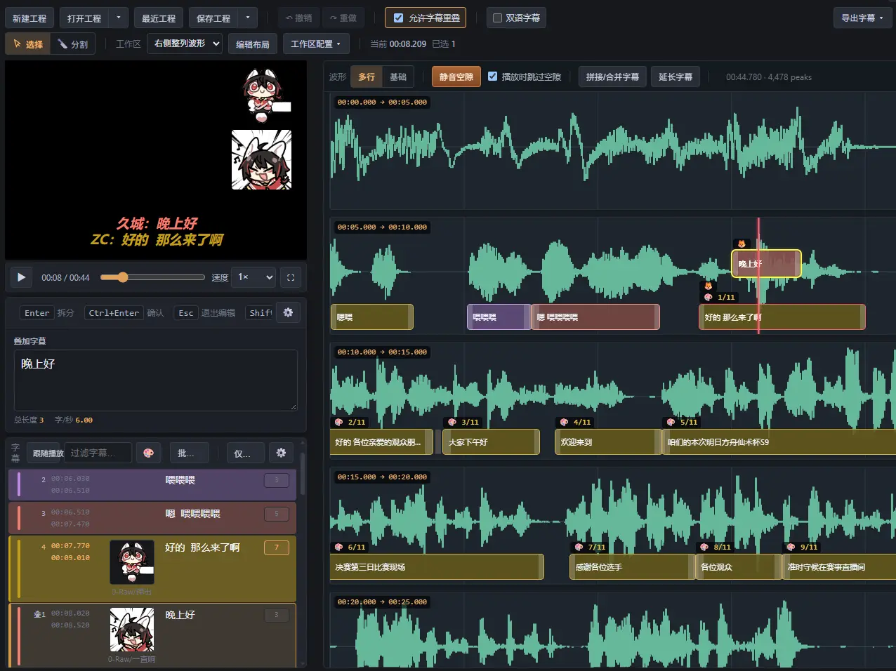

# Moy's ASR Workflow (MAW)

> Local media → ASR → SRT + `.mosp` project → MAWE editor → export.

MAW is an API-first subtitle generation and editing workflow. It provides a graphical Launcher, a public CLI, and a local Server editor. Available packages depend on each release. Editing and project storage stay on your machine.

*Editor example from 1.6.0: review text and video on the left, adjust timing against the waveform on the right. Workspace layouts are configurable.*

Latest beta: [v1.8.0-beta.1](https://github.com/Moyf/moys-asr-workflow/releases/tag/v1.8.0-beta.1).

## Quick start

1. [Download a package](https://github.com/Moyf/moys-asr-workflow/releases/latest) for your system and architecture. The full MAW bundle includes FFmpeg/FFprobe; MAW-lite requires both tools installed separately. Keep the complete extracted directory.
2. Launch `MAW.exe` on Windows or `MAW.app` on macOS.
3. Choose an ASR provider, configure your own key, and transcribe a short sample before processing the full recording.
4. Open MAWE, review the subtitles, save the `.mosp` project, and export SRT or ASS.

For source installation and a complete first run, see the [workflow guide](docs/WORKFLOW.md). Detailed documentation is currently in Chinese.

## Core capabilities

- Transcribe with Qwen, Fun-ASR, Soniox, Tencent Cloud, Volcengine Doubao, or an OpenAI-compatible ASR endpoint and generate SRT plus a `.mosp` project.
- Edit in the MAWE Server editor with waveform navigation, split/merge, silence-gap handling, video preview, and multiple export formats.
- Use the public CLI for batch jobs and AI automation: [CLI documentation](docs/CLI.md) (Chinese).
- [Local ASR models](docs/LOCAL_ASR.md) and the key-free Bcut ASR path are experimental.

## Documentation

- [Documentation index](docs/README.md): user guides, technical contracts, and historical records.
- [Workflow](docs/WORKFLOW.md), [Launcher](docs/LAUNCHER_GUIDE.md), and [providers](docs/PROVIDERS.md): install, configure, and transcribe.
- [Toolbox](docs/TOOLBOX.md) and [automatic processing](docs/POSTPROCESS_PIPELINE.md): script matching, cleanup, translation, OCR, and media tools.
- [Editor](docs/EDITOR_GUIDE.md), [keyboard timing](docs/KEYBOARD_ADJUSTMENT.md), [multiple subtitles](docs/MULTI_SUBTITLE.md), and [ASS styles](docs/ASS_STYLES.md): edit, save, and export.
- [CLI](docs/CLI.md) and [local ASR](docs/LOCAL_ASR.md): automate tasks and use experimental local models.
- [FAQ](docs/FAQ.md), [project schema](JSON_SCHEMA.md), [LLM protocol](docs/LLM_POSTPROCESS_PROTOCOL.md), and [development](docs/DEVELOPMENT.md).

## Data and limitations

Keep the original media and `.mosp` project. Projects contain UTF-8 JSON; older `.json` projects remain supported. SRT and ASS are delivery formats and cannot restore all word timing or editing state. Waveform data is a rebuildable cache.

Cloud transcription sends audio directly to the selected provider. Optional LLM processing sends subtitle text, and AI cleanup also sends script text. MAW has no hosted transcription server; editing and saving normally happen locally. Keys are configured on your machine. Pricing and data policies depend on the provider.

## Support and license

Please use [GitHub Issues](https://github.com/Moyf/moys-asr-workflow/issues) for questions and bug reports. Chinese-language discussion is available in [QQ group 1079160201](https://qm.qq.com/q/4YtxZIpzxC).

Licensed under [AGPL-3.0-only](LICENSE).
